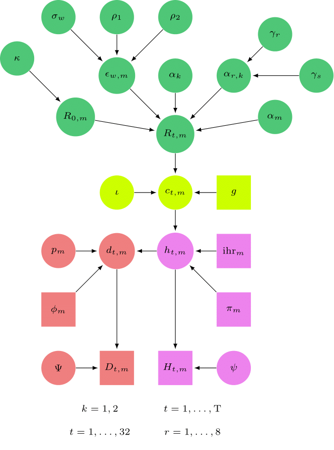
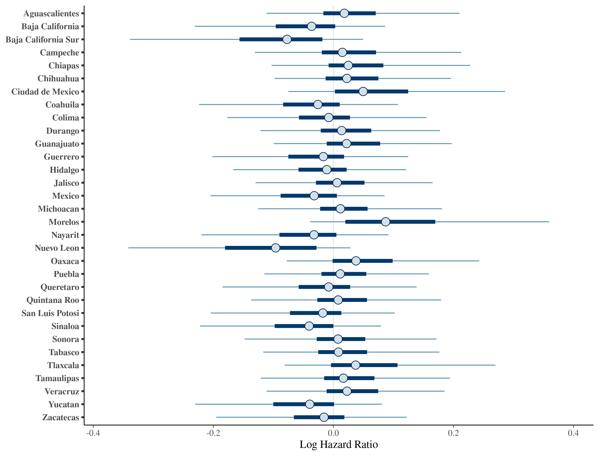
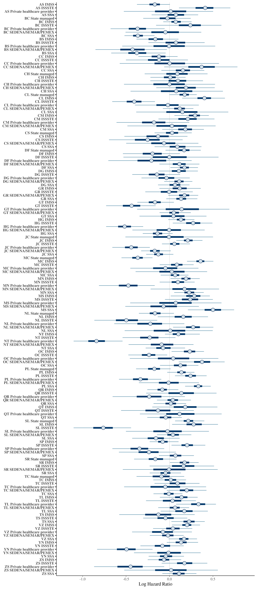
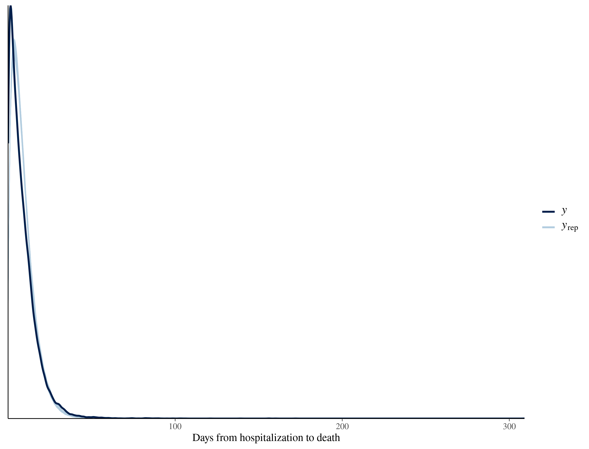
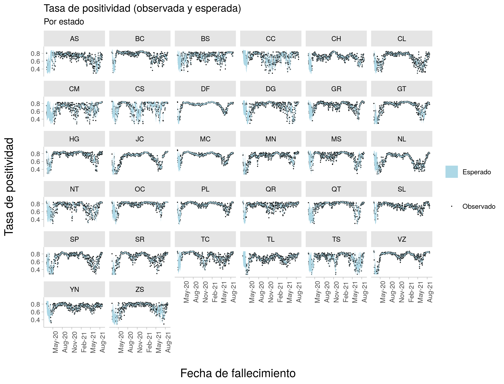
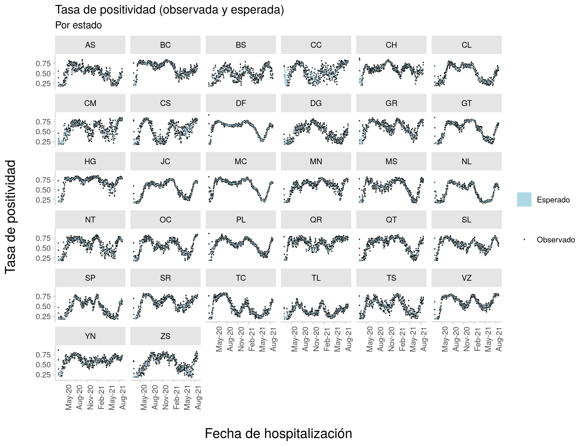
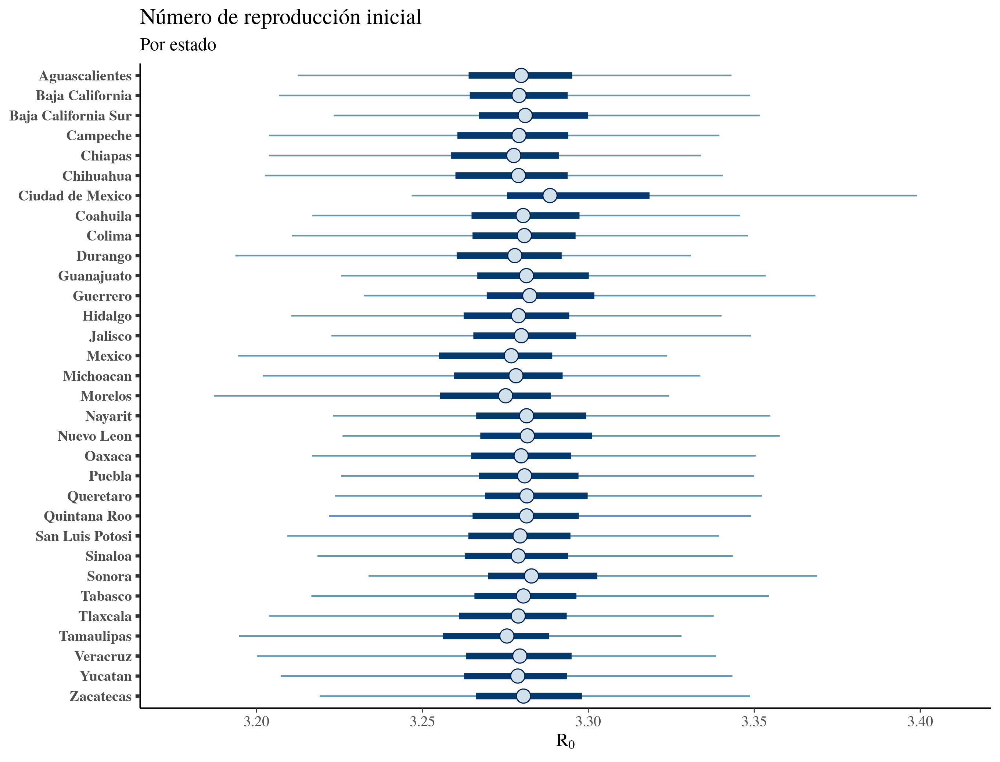
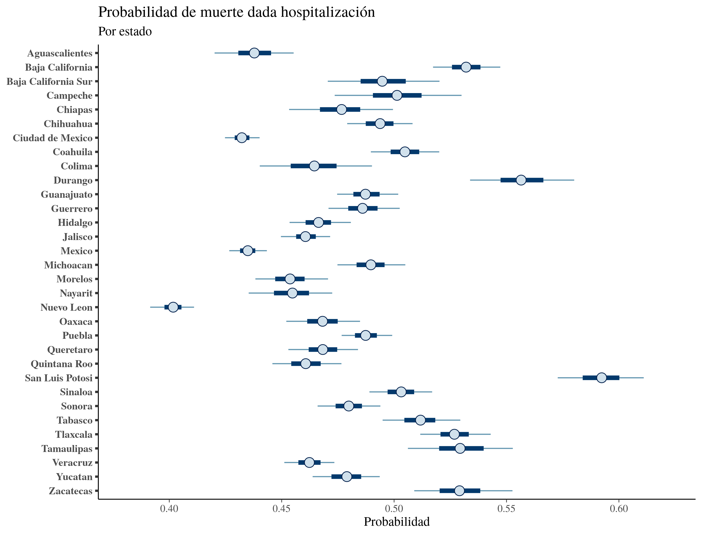
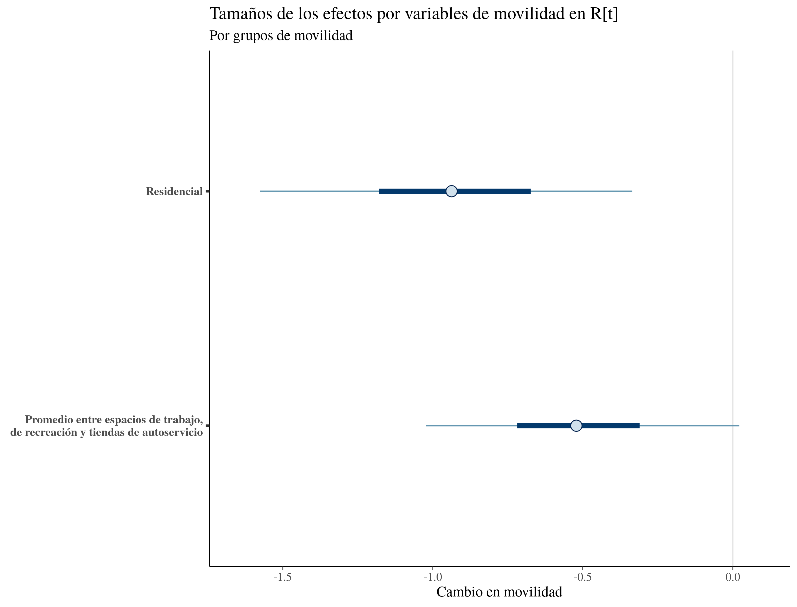

```{r setup, include=FALSE}
knitr::opts_chunk$set(echo = TRUE,fig.align = "center")
```

# Introducción

Muchos de los modelos epidemiológicos se basan en la incidencia de casos confirmados para poder hacer estimaciones y/o proyecciones de diferentes desenlaces en salud, ya sea mortalidad, hospitalizaciones, intubaciones, etc.  Sin embargo, una de las grandes limitaciones de estos modelos es que no consideran el tiempo que pasa entre el momento de la infección y el momento que la prueba resulta positiva. Una consecuencia de este desfase es que los casos confirmados que se presentan día a día son en realidad los casos que se infectaron hace 2 semanas o más. Adicionalmente, el sistema de vigilancia en México no realiza pruebas a aquellos que no cumplen la definición operacional, implicando que este sistema no logra capturar a todas las personas asintomáticas.

Uno de los modelos epidemiológicos fue propuesto por el [Imperial College de Reino Unido](https://www.imperial.ac.uk/mrc-global-infectious-disease-analysis/covid-19/report-13-europe-npi-impact/), el cual originalmente estimó el número esperado de muertes, el número esperado de infecciones, el número efectivo de reproducción ($R_0$ y $R_t$) y el impacto que han tenido distintas medidas de mitigación en $R_t$. **Este modelo se diferencia de los demás ya que aprende solamente de las muertes observadas**. Versiones más recientes de este modelo incluyeron el efecto de la [movilidad](https://www.imperial.ac.uk/mrc-global-infectious-disease-analysis/covid-19/report-23-united-states/) en $R_t$.

Utilizando la base de datos disponible en el Sistema Nacional de Vigilancia Epidemiológica (SISVER) a cargo de la Secretaría de Salud (SSA), utilizamos un modelo jerárquico con enfoque Bayesiano basado en el modelo del Imperial College con algunas diferencias:

1. Inclusión de hospitalizaciones - Adicionado a las muertes observadas, nuestro modelo aprende también de las hospitalizaciones observadas.
2. Inclusión de los efectos de comorbilidades así como diferencias regionales - Para tomar en cuenta el transcurso natural de la enfermedad, desarrollamos un modelo multi-nivel multi-estado (ver [preprint](https://www.medrxiv.org/content/10.1101/2021.05.24.21257752v1)).  Este modelo permite obtener información sobre los tiempos entre síntomas-hospitalización y hospitalización-muerte, por entidad federativa y por sector de atención.
3. Imputación de muertes y hospitalizaciones por retrasos en SISVER - Tomando en cuenta el porcentaje de positividad por entidad federativa a través del tiempo, estimamos un modelo autoregresivo de tercer orden $AR(3)$ para poder modelar este porcentaje con el fin de incluir una parte de los casos sospechosos en nuestas muertes y hospitalizaciones observadas.

# Métodos

## Caracterización del modelo

Primero describiremos el modelo propuesto por @Flaxman2020. Asimimismo, describiremos nuestras modificaciones previamente mencionadas. La Figura \@ref(fig:DAG1) muestra la relación entre todos los parámetros de nuestro modelo:

```{r DAG1, echo = FALSE, message=FALSE, fig.cap='Grafo acíclico dirigido'}

```


### Muertes y hospitalizaciones observadas

Denotemos a $D_{t,m}$ como el número de muertes observadas al día $t$ para la entidad federativa $m$; $t\in{1,\dots,n}$ y $m={1,\ldots,32}$. El modelo asume que $D_{t,m}$ proviene de una distribución binomal negativa tal que:

$$
D_{t,m} \sim \text{NegBin}\Big(d_{t,m},d_{t,m}+\frac{d_{t,m}^2}{|\Psi|}\Big),
$$

donde $d_{t,m}=\text{E}(D_{t,m})$ representa el número eseperado de muertes atribuibles a COVID-19 y $|\Psi|$ es el parámetro de dispersión con $\Psi \sim \mathcal{N}(0,5)$.  

Sea $H_{t,m}$ el número observado de hospitalizaciones, donde:

$$
H_{t,m} \sim \text{NegBin}\Big(h_{t,m},h_{t,m}+\frac{h_{t,m}^2}{|\psi|}\Big),
$$

donde $h_{t,m}=\text{E}(H_{t,m})$ denota el número esperado de hospitalizaciones atribuibles a COVID-19 y $|\psi|$ es el parámetro de dispersión.

<!-- Since $d_{t,m}$ is modelled through the number of infections $c$in previous days, one consideration to be made is that -->
### Modelado y dependencia entre muertes y hospitalizaciones

El número esperado de muertes puede ser determinado pore el número de hospitalizaciones ($h_m$), la distribución del tiempo entre la hospitalización y la muerte ($\phi_m$) y la tasa de muerte dada la hospitalización ($p_m$). Asimismo, el número esperado de hospitalizaciones está determinado por el número de infecciones ($c_m$), el tiempo entre infección y hospitalización ($\pi_m$) y la tasa de hospitalización dado la infección (infection hospitalization rate) $\text{ihr}_m$.

_Tasa de infección dada la hospitalización_

La tasa de hospitalización dado la infección fue obtenida de estimaciones previas que asumen tasas de ataque homogéneas en diferentes grupos de edad [@Verity2020]. Dado que México no tiene datos relacionados al potencial contacto entre los individuos, se utilizaron los datos de Reino Unido tomando en cuenta los datos poblacionales de las entidades federativas. Lo anterior resultó en tasas de infección $\text{ihr}_m$ para cada estado. Adicionalmente introducimos ruido a cada tasa con la siguiente distribución:

$$
\text{ihr}_m^* \sim \text{ihr}_m \cdot \mathcal{N}(1,0.1).
$$

_Distribución del tiempo entre infección y hospitalización_

La distribución del tiempo entre infección y hospitalización puede ser definida como la suma de 2 tiempos aleatorios: 

1. Tiempo entre infección e inicio de síntomas.
2. Tiempo entre síntomas y hospitalización.

Denotamos estos tiempos con $\pi_1$ y $\pi_{2,m}$, respectivamente. Por lo tanto:


$$
\pi_m = \pi_1 + \pi_{2,m} 
$$
$$
\pi_1 \sim \text{Gamma}(5.1,0.86) 
$$
donde $\pi_{2,m}$ corresponde a la distribución posterior predictiva de nuestro modelo multi-estado. Los parámetros de $\pi_1$ corresponden a datos epidemiológicos de estudios previos [@Verity2020; @Ferguson2020].


_Distribución del tiempo entre hospitalización y muerte_

Igual que la sección previa y utilizando nuestro modelo multi-estado, $\phi_m$ representa la distribución del tiempo entre la hospitalización y muerte.

_Número esperado de muertes y hospitalizaciones_

Tomando en cuenta lo anterior, el número esperado de muertes está dado por:

$$
d_{t,m} = p_m\sum_{\tau=0}^{t-1}h_{\tau,m}\phi_{t-\tau,m}^*,
$$

donde $\phi^*$ es discretizado por $\phi_{s,m} = \int_{s-0.5}^{s+0.5} \phi(\tau)d\tau$ para $s = 2,3,\ldots$ y $\phi_{1,m} = \int_{0}^{1.5} \phi(\tau)d\tau$, donde $\phi(\tau)$ es la función de densidad de $\phi$. Esto quiere decir que **el número esperado de muertes al día de hoy está dado por la suma de las hospitalizaciones de los días previos ponderado por la probabilidad de morir**.

El número esperado de hospitalizaciones está dado por:

$$
h_{t,m} = \text{ihr}_m^*\sum_{\tau=0}^{t-1}c_{\tau,m}\pi_{t-\tau,m}^*,
$$

donde $c_{\tau,m}$ es el número esperado de infecciones en el día $\tau$ para el estado $m$.

### Modelado de las infecciones

Sabemos que la detección de nuevas infecciones por SARS-CoV-2 están dadas por:

1. La capacidad de cada estado en realizar pruebas.
2. La cantidad de casos asintomáticos.

El modelo asume que el número esperado de infecciones $c_m$ para cada entidad federativa está determinado por un proceso de renovación. Asimsmo, utilizamos el tiempo entre infecciones entre los individuos $g$ (serial interval). De tal manera que el número esperado de infecciones al día $t$ en el estado $m$ está dado por:


$$
c_{t,m} = \Big( 1-\frac{\sum_{i=1}^{t-1}c_{i,m}}{N_m}\Big)R_{t,m}\sum_{\tau=0}^{t-1}c_{\tau,m}g_{t-\tau},
$$
donde $N_m$ es la población del estado $m$, $R_{t,m}$ es el número efectivo de reproducción al día $t$ en el estado m $m$ y $g_{s}$ es el tiempo entre infecciones discretizado por $g_{s} = \int_{s-0.5}^{s+0.5} g(\tau)d\tau$ para $s = 2,3,\ldots$ y $g_{1} = \int_{0}^{1.5} g(\tau)d\tau$, con $g(\tau)$ siendo generado por $g \sim \text{Gamma}(6.5,0.62)$ [@Bi2020]. El factor $1-N_m^{-1}\sum_{i=1}^{t-1}c_{i,m}$ ajusta a $R_{t,m}$ con el fin de tomar en cuenta el acumulado de infectados al día $t$, es decir, a medida que más personas se infecten menos personas susceptibles habrán. **Esta ecuación nos dice que el número esperado de infecciones al día de hoy depende de los infectados en días anterior ponderados por el tiempo entre infecciones entre los individuos y el número efectivo de reproducción.**

### Número efectivo de reproducción

El modelo original de @Flaxman2020 consideraba el efecto de las medidas de mitigación en $R_{t,m}$, como el cierre de escuelas, confinamientos etc. En Brasil y Estados Unidos, donde el modelo del Imperial College fue también utilizado, se incorporó el cambio en movilidad en diferentes lugares (parques, tránsito, áreas residenciales, etc.) [@Mellan2020,@Unwin2020]. Estos reportes de movilidad son capturados por Google [@Aktay2020] y se actualizan semanalmente. 

Nuestro modelo utiliza el cambio de movilidad en áreas residenciales ($l=1$) y el promedio entre el cambio en movilidad de espacios de trabajo, de recreación y tiendas de autoservicio ($l=2$). De tal manera que:

$$
R_{t,m} = R_{0,m}\Big(2\lambda\Big\{ -(\sum_{l=1}^3 \alpha_kI_{l,t,m})-\alpha_{r(m)}^{\text{region}}I_{2,t,m} - \alpha_m^{\text{state}}I_{2,t,m}-\epsilon_{w_m(t),m} \Big\}\Big),
$$

donde $\lambda$ es la función logística, $\alpha_k$ denota los efectos para los 32 estados, $\alpha_{r(m)}^{\text{region}}$ representa específcos de las regiones, $\alpha_m^{\text{state}}$ son efectos estatales y $\epsilon_{w_m(t),m}$ es un proceso **semanal** autoregresivo de orden 2 ($AR(2)$) centrado en 0 y con desviación estándar estacionaria $\sigma_w$ que captura la variación entre estados que no es posible explicar por los indicadores de movilidad [@Unwin2020]. $AR(2)$ empieza con $\epsilon_{1,m} \sim  \mathcal{N}(0,\sigma_w^*)$ y:

$$
\begin{aligned}
\epsilon_{1,m} &\sim  \mathcal{N}(\rho_1\epsilon_{w-1,m}+\rho_1\epsilon_{w-2,m},\sigma_w^*) \space \text{para} \space m=2,3,\dots,W \\
\rho_1 &\sim \mathcal{N}(08,.05) \\
\rho_2 &\sim \mathcal{N}(.1,.05) \\
\sigma_w &\sim \mathcal{N}^+(0,.2) \\
\sigma_w^* &= \sigma_w\sqrt{1-\rho_1^2-\rho_1^2-2\rho_1^2\rho_2/(1-\rho_2)}
\end{aligned}
$$
con $\rho_1$ y $\rho_2$ $\in [0,1]$


La distribución a priori para $R_{0,m}=|R_{0,m}^*|$ es:

$$
R_{0,m}^* \sim \mathcal{N}(3.28, |\kappa|)
$$
$$
\kappa \sim \mathcal{N}(0,0.5),
$$

donde $\kappa$ le da variabilidad a $R_{0,m}$ dado que éste aprende de todas las entidades federativas. La media de 3.28 fue obtenida de un meta-análsis previo [@Liu2020].  Las distribuciones a priori de los hiperparámetros de $R_{t,m}$ están determinados por:


$$
\alpha_k \sim \mathcal{N}(0,0.5)
$$

$$
\alpha_{r(m)}^{\text{región}} \sim \mathcal{N}(0,|\gamma_r|), \ \ \gamma_r \sim \mathcal{N}(0,0.5),
$$

$$
\alpha_m^{\text{estado}} \sim \mathcal{N}(0,|\gamma_s|), \ \ \gamma_s \sim \mathcal{N}(0,0.5).
$$

Finalmente el modelo asume que el número esperado de infecciones ocurren 21 días antes de que el estado $m$ haya acumulado 10 muertes observadas. A partir de esta fecha, simulamos 6 días seguidos de infecciones $c_{1,m},...,c_{6,m}\sim \mathrm{Exp}(\iota)$, donde $\iota\sim \mathrm{Exp}(0.3)$, Estas infecciones se infieren con la distribución posterior.

## Estadística computacional

+ Inferencia Bayesiana, es decir, $\mathbb{P}(\boldsymbol{\theta}|\mathcal{D}) \propto \mathbb{P}(\mathcal{D}|\boldsymbol{\theta})\mathbb{P}(\boldsymbol{\theta})$ donde  $\boldsymbol{\theta}=\{\alpha_k,\alpha_m,\kappa,\dots\}$. Más de 1,500 parámetros a estimar.

+ Muestrear de la posterior utilizando cadenas de Markov Monte Carlo (MCMC). Se utilizó el lenguaje de programación `Stan`, el cual implementa el algoritmo Monte Carlo Hamiltoniano [@carpenter2017stan]. 

+ Debido a lo anterior, se utilizó una supercomputadora con el objetivo de agilizar el proceso de estimación. Éste duró 50 horas.

# Resultados

## Modelo multi-estado

```{r echo=FALSE,fig.cap="Efectos aleatorios por estado"}

```

```{r echo=FALSE,fig.cap="Efectos aleatorios por estado y sector"}

```

```{r echo=FALSE,fig.cap="Distribución posterior predictiva para tiempo entre hospitalización y muerte"}

```

## Imputación de muertes y hospitalizaciones

```{r echo=FALSE,fig.cap="Tasa de positividad en el tiempo para muertes observadas"}

```

```{r echo=FALSE,fig.cap="Tasa de positividad en el tiempo para hospitalizaciones observadas"}

```

## Modelo epidemiológico

```{r echo=FALSE}
attackRate = read.csv("./img/attack-rate.csv")
knitr::kable(attackRate,caption = "Tasa de ataque y número esperado de infecciones acumulado hasta el 24-08-21",col.names = c("Estado","Tasa de ataque [95% ICr]","Total [95% ICr] "))
```

```{r echo=FALSE,fig.cap="Número básico de reproducción"}

```

```{r echo=FALSE,fig.cap="Porcentaje de pacientes que mueren dado que fueron hospitalizados"}

```

```{r echo=FALSE,fig.cap="Efecto del cambio en movilidad para todas las entidades federativas"}

```

```{r echo=FALSE,fig.cap="Agregar caption"}

```

```{r echo=FALSE,fig.cap="Agregar caption"}

```

# Limitaciones

+ Sub-estimación del número de muertes y hospitalizados.
+ Impacto de la vacunación.
+ Cambio en la tasa de reproducción con nuevas variantes.

